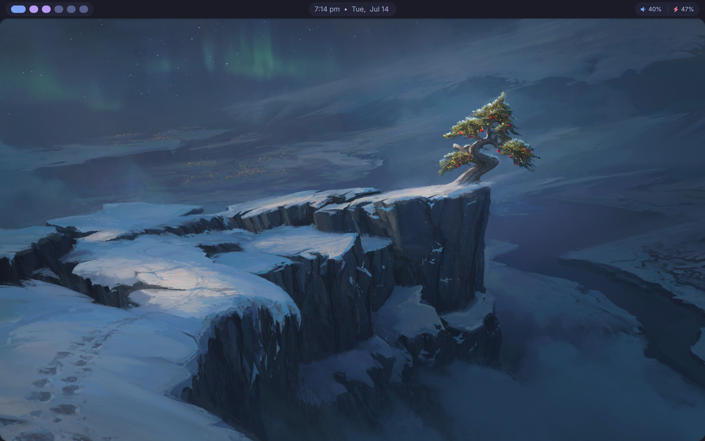

# Kyoko NixOS

NixOS flake configuration with MangoWM and Quickshell.

## Apps

* **WM:** MangoWM (Wayland compositor)
* **Shell:** Quickshell (desktop panel, launcher, clipboard, emoji picker, wallpaper selector)
* **Terminal:** foot
* **Browser:** Firefox (hardened)
* **Editor:** Neovim via nvf
* **AI:** OpenCode with local llama.cpp (Intel Arc GPU)
* **Screenshots:** msnap (grim + slurp + satty + wayfreeze)
* **Audio:** pavucontrol / pwvucontrol
* **Bluetooth:** blueman
* **File manager:** Nautilus, Thunar
* **Media:** mpv
* **Minecraft:** Prism Launcher
* **Game tools:** mangohud, gamemode, gamescope
* **Screen recording:** GPU Screen Recorder
* **Clipboard:** cliphist + wl clipboard
* **Lock screen:** enfield lock

## Credits

Desktop shell UI heavily inspired by [Octashell](https://github.com/octagonemusic/octashell).
